# 🔐 Cybernews Automation

> An automated n8n workflow that fetches daily cybersecurity news and delivers formatted email summaries

[](https://n8n.io/)
[](https://opensource.org/licenses/MIT)

## 📋 Table of Contents

- [🎯 Overview](#-overview)
- [✨ Features](#-features)
- [🏗️ Architecture](#️-architecture)
- [📸 Workflow Preview](#-workflow-preview)
- [🔧 Prerequisites](#-prerequisites)
- [📥 Installation](#-installation)
- [⚙️ Configuration](#️-configuration)
- [🔒 Security](#-security)
- [🎨 Customization](#-customization)
- [🐛 Troubleshooting](#-troubleshooting)
- [📦 Project Structure](#-project-structure)
- [🤝 Contributing](#-contributing)
- [📄 License](#-license)
- [👨‍💻 Author](#-author)

## 🎯 Overview

This project automates the process of gathering cybersecurity news and delivering daily email digests. Built with [n8n](https://n8n.io/), it fetches the latest security-related articles from NewsAPI, formats them into readable summaries, and sends them via email.

### Workflow Components

1. **Schedule Trigger** - Runs daily at 9 AM (configurable)
2. **News Fetcher** - Retrieves cybersecurity articles from NewsAPI
3. **Content Formatter** - JavaScript function to create formatted summaries
4. **Email Sender** - Delivers the digest via Gmail SMTP

## ✨ Features

- 🔍 **Smart News Filtering**: Searches for keywords like "hacking", "cybersecurity", "penetration testing"
- 📅 **Daily Automation**: Scheduled execution with customizable timing
- 📝 **Intelligent Summarization**: Truncates articles to 300 characters or 2 sentences
- 🌏 **Localized Formatting**: Indian date format (DD MMM YYYY)
- 📧 **Email Delivery**: Clean, formatted HTML emails with emojis
- 🔄 **Error Handling**: Fallback values for missing article data

## 🏗️ Architecture

```mermaid
graph LR
    A[⏰ Schedule Trigger<br/>Daily @ 9 AM] --> B[🌐 Fetch News<br/>NewsAPI]
    B --> C[📝 Format Summary<br/>JavaScript]
    C --> D[📧 Send Email<br/>Gmail SMTP]
```



## 📸 Workflow Preview


<details>
<summary>View Individual Node Screenshots</summary>

### Schedule Trigger Node


### HTTP Request Node


### Function Node


### Email Node


</details>

## 🔧 Prerequisites

- [n8n](https://n8n.io/) instance (cloud or self-hosted)
- [NewsAPI](https://newsapi.org/) account and API key
- Gmail account with [App Password](https://support.google.com/accounts/answer/185833) or OAuth2 setup
- Basic understanding of n8n workflows

## 📥 Installation

### Option 1: Import Workflow (Recommended)

1. Download [`automation email news.json`](automation%20email%20news.json)
2. Open your n8n instance
3. Go to **Workflows** → **Import**
4. Select the downloaded JSON file
5. Click **Import**

### Option 2: Manual Setup

1. Create a new workflow in n8n
2. Add nodes in this order:
   - Schedule Trigger
   - HTTP Request
   - Function
   - Send Email
3. Connect nodes sequentially
4. Configure each node as described below

## ⚙️ Configuration

### 1. NewsAPI Setup

1. Sign up at [NewsAPI.org](https://newsapi.org/)
2. Get your API key from the dashboard
3. In the HTTP Request node, replace `YOUR_NEWSAPI_KEY_HERE` with your actual key

⚠️ **Security Note**: Never commit your actual API key to version control!

### 2. Email Configuration

In the Send Email node:

```
From Email: your-email@gmail.com
To Email: recipient@example.com
Subject: 📰 Daily Indian News Summary
```

#### Gmail App Password Setup

1. Enable 2-factor authentication on your Google account
2. Go to [App Passwords](https://myaccount.google.com/apppasswords)
3. Generate a new app password for "Mail"
4. Use this password in n8n's SMTP credentials

### 3. Schedule Configuration

The default schedule runs at 9:00 AM daily. To modify:

1. Open the Schedule Trigger node
2. Adjust the trigger time or frequency
3. Options include:
   - Specific times (e.g., 9 AM, 6 PM)
   - Intervals (every X hours/minutes)
   - Cron expressions for advanced scheduling

## 🔒 Security

### Best Practices

1. **API Key Management**
   - Store API keys in n8n credentials, not in the workflow
   - Use environment variables for sensitive data
   - Rotate API keys regularly

2. **Email Security**
   - Use OAuth2 instead of passwords when possible
   - Enable 2FA on email accounts
   - Limit email permissions to send-only

3. **Workflow Security**
   - Keep n8n instance updated
   - Use HTTPS for n8n web interface
   - Implement access controls

### Environment Variables

For production deployments, use environment variables:

```bash
export NEWSAPI_KEY="your-api-key-here"
export GMAIL_USER="your-email@gmail.com"
export GMAIL_APP_PASSWORD="your-app-password"
```

## 🎨 Customization

### Modify Search Keywords

Edit the NewsAPI URL in the HTTP Request node:

```
q=hacking OR cybersecurity OR "data breach" OR ransomware
```

### Change Article Count

Modify `pageSize` parameter (max 100):

```
pageSize=20
```

### Customize Email Format

Edit the JavaScript in the Function node ([`formatnewssummarycode.txt`](formatnewssummarycode.txt)):

```javascript
const articles = items[0].json.articles;
let summary = '**🧠 Daily Hacker News Digest**\n\n';

articles.forEach((article, index) => {
  const title = article.title || 'No Title';
  const url = article.url || '#';
  const date = new Date(article.publishedAt).toLocaleDateString('en-IN', {
    day: '2-digit', month: 'short', year: 'numeric'
  });

  // Better summary logic: take first 2 sentences or 300 chars max
  const description = article.description || '';
  let shortDescription = description.split('. ').slice(0, 2).join('. ');
  shortDescription = shortDescription.length > 300 ? shortDescription.slice(0, 300) + '...' : shortDescription;

  summary += `🔐 *${index + 1}. ${title}*\n📅 ${date}\n🔗 ${url}\n📝 ${shortDescription || 'No summary available.'}\n\n`;
});

return [{ json: { newsSummary: summary } }];


```

### Filter by Region

Add country parameter to NewsAPI:

```
&country=in  // India
&country=us  // United States
&country=gb  // United Kingdom
```

## 🐛 Troubleshooting

### Common Issues

1. **No articles found**
   - Check API key validity
   - Verify search keywords
   - Ensure API rate limits aren't exceeded

2. **Email not sending**
   - Verify SMTP credentials
   - Check spam folder
   - Ensure "Less secure app access" is enabled (if not using App Password)

3. **Workflow not triggering**
   - Verify workflow is active
   - Check n8n instance timezone
   - Ensure n8n service is running

### Debug Mode

Enable debug output in the Function node:

```javascript
console.log('Articles received:', articles.length);
console.log('First article:', articles[0]);
```

## 📦 Project Structure

```
cybernews-automation/
├── automation email news.json   # n8n workflow export
├── formatnewssummarycode.txt   # JavaScript formatter code
├── README.md                   # This documentation
└── screenshots/                # Workflow screenshots (optional)
```

## 🤝 Contributing

Contributions are welcome! Here are some ideas:

- [ ] Add support for multiple news sources
- [ ] Implement Telegram/Slack notifications
- [ ] Add sentiment analysis
- [ ] Create weekly/monthly summaries
- [ ] Add RSS feed support
- [ ] Implement keyword filtering
- [ ] Add multi-language support

### How to Contribute

1. Fork the repository
2. Create a feature branch (`git checkout -b feature/amazing-feature`)
3. Commit your changes (`git commit -m 'Add amazing feature'`)
4. Push to the branch (`git push origin feature/amazing-feature`)
5. Open a Pull Request

## 📄 License

This project is licensed under the MIT License - see the [LICENSE](LICENSE) file for details.

## 👨‍💻 Author

Created with 💻 by [BadshaHac](https://github.com/BadshaHac)

---

<div align="center">

**Found this helpful? Give it a ⭐!**

[Report Bug](https://github.com/BadshaHac/cybernews-automation/issues) · [Request Feature](https://github.com/BadshaHac/cybernews-automation/issues)

</div>
